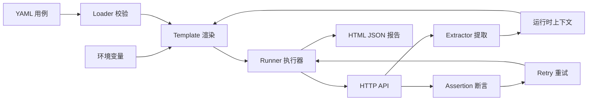

# SDETFlow 接口自动化测试框架

SDETFlow 是一个面向测试开发工程师的轻量级接口自动化框架。测试人员使用 YAML 描述业务链路，框架负责变量渲染、接口调用、动态数据提取、断言、失败重试和报告生成。仓库同时提供可运行的电商 Mock 服务，用于演示“登录 - 查询商品 - 创建订单 - 查询订单”的完整接口关联场景。

> 这个项目关注测试平台中最常见、最值得工程化的能力，不依赖企业内部系统或私有测试数据，适合本地学习、技术面试演示和二次开发。

## 项目亮点

- **业务链路编排**：使用 YAML 组织多步骤接口场景，测试数据与执行引擎解耦。
- **动态上下文**：支持 `${variable}` 变量替换、嵌套对象及原生数据类型透传。
- **接口关联**：通过轻量 JSONPath 表达式提取 Token、订单号等数据，自动传递给后续步骤。
- **可扩展断言**：内置状态码、相等、大小比较、包含、长度、存在性等断言。
- **稳定性治理**：为异步接口提供可配置重试和等待间隔，记录实际尝试次数。
- **结果可观测**：同时生成 HTML 与 JSON 报告，展示成功率、耗时、状态码及失败原因。
- **工程化交付**：包含类型标注、单元测试、覆盖率门禁、Ruff、Docker 和 GitHub Actions。

## 架构设计



核心模块职责：

| 模块 | 职责 |
| --- | --- |
| `loader.py` | YAML 解析、结构校验、环境变量覆盖 |
| `template.py` | 递归变量渲染与原生类型保持 |
| `extract.py` | 响应状态、Header、JSONPath 数据提取 |
| `assertions.py` | 可组合的响应断言 |
| `runner.py` | 用例调度、上下文传递、重试和结果聚合 |
| `report.py` | HTML 与 JSON 双格式报告 |

## 快速开始

### 1. 安装项目

需要 Python 3.10 或更高版本。

```bash
git clone https://github.com/harutyakobasolo-collab/didactic-succotash.git
cd didactic-succotash
python -m venv .venv
```

Windows：

```powershell
.venv\Scripts\Activate.ps1
python -m pip install -e ".[dev,mock]"
```

macOS / Linux：

```bash
source .venv/bin/activate
python -m pip install -e ".[dev,mock]"
```

### 2. 启动示例服务

```bash
uvicorn mock_service.app:app --reload
```

服务启动后可访问：

- 健康检查：`http://127.0.0.1:8000/health`
- Swagger 文档：`http://127.0.0.1:8000/docs`

### 3. 执行接口测试

打开另一个终端：

```bash
sdetflow examples/ecommerce/cases.yaml \
  --env examples/ecommerce/environment.yaml
```

按标签执行冒烟测试：

```bash
sdetflow examples/ecommerce/cases.yaml \
  --env examples/ecommerce/environment.yaml \
  --tag smoke
```

执行完成后打开 `reports/report.html` 查看可视化报告。

## YAML 用例示例

```yaml
cases:
  - name: 用户登录与下单主链路
    tags: [smoke, order]
    steps:
      - name: 登录并提取访问令牌
        request:
          method: POST
          path: /api/login
          json:
            username: ${username}
            password: ${password}
        extract:
          access_token: $.data.access_token
        assert:
          - source: status_code
            operator: eq
            expected: 200

      - name: 携带令牌查询商品
        request:
          method: GET
          path: /api/products
          headers:
            Authorization: Bearer ${access_token}
        assert:
          - source: $.data.items
            operator: length_eq
            expected: 2
```

### 数据优先级

运行时变量按以下顺序覆盖，越靠后优先级越高：

1. 环境 YAML
2. `SDETFLOW_` 前缀的系统环境变量
3. 用例级 `variables`
4. 前置步骤 `extract` 产生的动态变量

例如，`SDETFLOW_BASE_URL=https://test.example.com` 会覆盖环境文件里的 `base_url`。

### 支持的提取来源

| 来源 | 示例 |
| --- | --- |
| HTTP 状态码 | `status_code` |
| 响应头 | `headers.x-trace-id` |
| 文本响应 | `text` |
| JSON 响应 | `$.data.items[0].id` |

### 支持的断言操作符

`eq`、`ne`、`gt`、`gte`、`lt`、`lte`、`contains`、`not_contains`、`length_eq`、`exists`

## Docker 运行

```bash
docker compose up --build --abort-on-container-exit
```

Compose 会先启动 Mock 服务，再执行完整示例用例。测试报告写入本地 `reports` 目录。

## 质量检查

```bash
pytest --cov=sdetflow --cov-report=term-missing
ruff check .
```

CI 会在 Python 3.10、3.11 和 3.12 上运行测试，并执行不低于 80% 的覆盖率门禁。

## 目录结构

```text
sdetflow/
├── .github/workflows/ci.yml       # 持续集成
├── examples/ecommerce/            # 示例环境和业务用例
├── mock_service/app.py            # FastAPI 模拟电商服务
├── src/sdetflow/                  # 框架核心代码
├── tests/                         # 单元测试
├── Dockerfile
├── docker-compose.yml
└── pyproject.toml
```

## 后续规划

- 接入 Allure 报告和历史趋势
- 支持数据库前置与后置校验
- 增加并发执行、失败重跑和用例依赖图
- 增加 Playwright UI 测试适配器
- 对接 Jenkins、飞书或企业微信通知

## License

[MIT](LICENSE)
